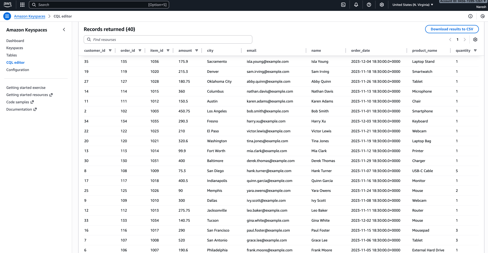

# Pipeline 1: RDS to Keyspaces

## Overview
This pipeline extracts data from three MySQL tables in RDS, performs joins to create a denormalized dataset, and loads the result into Amazon Keyspaces.

## Source System
**Database:** RDS MySQL

**Tables:**
- customers: Contains customer master data with customer_id, name, email, and city
- orders: Contains order transactions with order_id, customer_id, order_date, and amount
- order_items: Contains line items with item_id, order_id, product_name, and quantity

## Target System
**Database:** Amazon Keyspaces

**Table:** retail.sales_data

**Schema Design:**
- Partition Key: customer_id
- Clustering Key: order_id
- Additional Columns: item_id, name, email, city, order_date, amount, product_name, quantity

## Transformation Logic

### Join Operations
The pipeline performs two sequential joins:

1. First join: customers with orders on customer_id
2. Second join: result with order_items on order_id

### Result
A denormalized table where each row represents one order item with complete customer and order information.

## Data Flow

1. Read three tables from MySQL using JDBC
2. Join customers and orders tables
3. Join the result with order_items table
4. Select required columns for final schema
5. Write to Keyspaces using Cassandra connector

## Avro Schema

The schema defines a record type called SalesData with the following fields:
- customer_id: integer
- name: string
- email: string
- city: string
- order_id: integer
- order_date: timestamp
- amount: double
- item_id: integer
- product_name: string
- quantity: integer

## Expected Output

### Input Example
- Customer: customer_id=1, name=John Doe
- Order: order_id=101 with amount=150.50
- Items: Two items (Laptop and Mouse) in order 101

### Output Example
The pipeline produces two rows:
- Row 1: All John Doe details + Order 101 details + Laptop details
- Row 2: All John Doe details + Order 101 details + Mouse details

Each order item becomes a separate row with duplicated customer and order information for analytical queries.

## Configuration Requirements

### MySQL Connection
- JDBC URL with host, port, and database name
- Username and password for authentication
- MySQL JDBC driver

### Keyspaces Connection
- Cassandra endpoint hostname
- Port number (typically 9142)
- SSL truststore path and password
- Username and password for authentication

### Spark Settings
- Cassandra connector configuration
- SSL enabled settings
- Authentication parameters

## Execution Steps

1. Set up source tables in RDS MySQL with sample data
2. Create target table in Keyspaces using CQL
3. Configure connection parameters for both MySQL and Keyspaces
4. Package the Spark application
5. Submit the Spark job with required JAR dependencies

## Key Learnings

### Data Modeling
Keyspaces uses partition and clustering keys for data distribution and sorting. Customer_id as partition key ensures all orders for a customer are stored together.

### Denormalization
Joining three normalized tables creates redundancy but enables faster analytical queries by avoiding joins at query time.

### Connector Usage
The Spark Cassandra connector simplifies writing to Keyspaces by handling connection management and batch operations automatically.

### Performance Considerations
- JDBC partitioning helps parallelize reads from MySQL
- Cassandra batch size affects write performance
- Join operations require sufficient executor memory