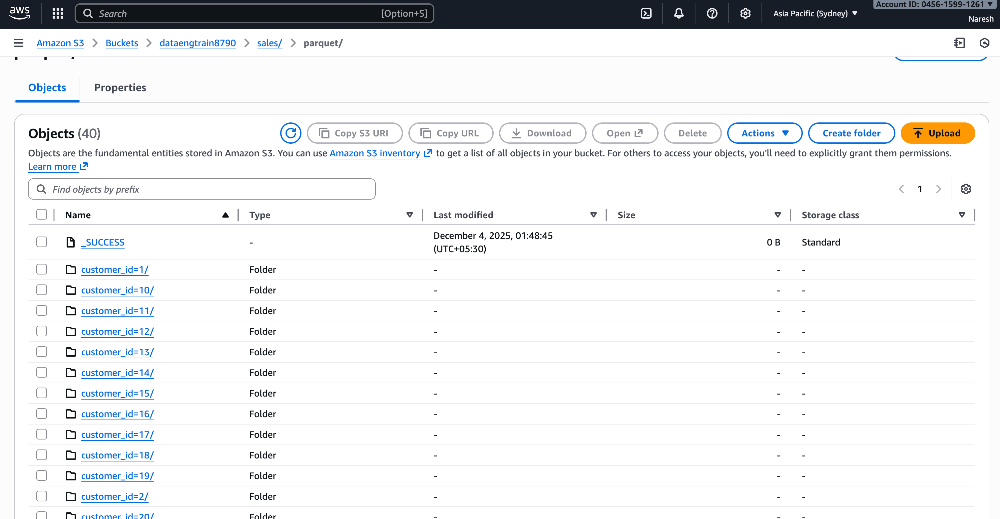

# Pipeline 2: Keyspaces to S3

## Overview
This pipeline reads denormalized sales data from Amazon Keyspaces and writes it as partitioned Parquet files to S3 for analytics and downstream processing.

## Source System
**Database:** Amazon Keyspaces

**Table:** retail.sales_data

**Schema:**
- customer_id: integer (Partition Key)
- order_id: integer (Clustering Key)
- item_id: integer
- name: text
- email: text
- city: text
- order_date: timestamp
- amount: double
- product_name: text
- quantity: integer

## Target System
**Storage:** Amazon S3

**Format:** Parquet

**Location:** s3://retail-output/sales/parquet/

**Partitioning:** By customer_id

## Transformation Logic

### Column Selection
The pipeline extracts a subset of columns for analytical purposes:
- customer_id
- order_id
- amount
- product_name
- quantity

### Partitioning Strategy
Data is partitioned by customer_id, which means:
- Each unique customer gets a separate directory
- Queries filtering by customer_id can skip irrelevant partitions
- Improves query performance for customer-specific analytics

## Data Flow

1. Read sales_data table from Keyspaces using Cassandra connector
2. Select required columns for analysis
3. Partition data by customer_id
4. Write as Parquet format to S3

## Input Table (Keyspaces)

### CQL Schema

The source table retail.sales_data must exist with the following structure:

```
CREATE TABLE retail.sales_data (
    customer_id int,
    order_id int,
    item_id int,
    name text,
    email text,
    city text,
    order_date timestamp,
    amount double,
    product_name text,
    quantity int,
    PRIMARY KEY (customer_id, order_id)
);
```

## Avro Schema

The schema defines a record type for the selected columns:

**Type:** Record  
**Name:** SalesPartial

**Fields:**
- customer_id: integer
- order_id: integer
- amount: double
- product_name: string
- quantity: integer

## Expected Output

### Input Example
Keyspaces table contains:
- Customer 1: 3 order items
- Customer 2: 2 order items
- Customer 3: 1 order item

### Output Example
S3 structure after execution:

```
s3://retail-output/sales/parquet/
├── customer_id=1/
│   └── contains 3 records in Parquet format
├── customer_id=2/
│   └── contains 2 records in Parquet format
└── customer_id=3/
    └── contains 1 record in Parquet format
```

Each partition contains only the data for that specific customer, stored in columnar Parquet format for efficient analytics.


### Sample Data Flow

**Keyspaces Input:**
- Record: customer_id=1, order_id=101, amount=150.50, product_name=Laptop, quantity=1

**S3 Output:**
- File: s3://retail-output/sales/parquet/customer_id=1/part-00000.parquet
- Contains: order_id=101, amount=150.50, product_name=Laptop, quantity=1

## Configuration Requirements

### Keyspaces Connection
- Cassandra endpoint hostname
- Port number (typically 9142)
- SSL truststore path and password
- Username and password for authentication
- Consistency level: LOCAL_QUORUM

### S3 Connection
- S3 endpoint URL
- AWS region
- Access key and secret key
- S3A filesystem implementation
- Credentials provider configuration

### Spark Settings
- Cassandra connector configuration
- Hadoop S3A settings for S3 access
- Connection pooling parameters

## Execution Steps

1. Ensure Keyspaces table retail.sales_data exists and contains data
2. Configure AWS credentials for S3 access
3. Set up SSL truststore for Keyspaces connection
4. Package the Spark application
5. Submit the Spark job with required dependencies

## Key Learnings

### Parquet Format Benefits
Parquet is a columnar storage format that provides:
- Efficient compression
- Fast column-based queries
- Schema evolution support
- Better performance for analytical workloads

### Partitioning Strategy
Partitioning by customer_id provides:
- Faster queries when filtering by customer
- Better data organization
- Reduced data scanning for customer-specific queries
- Improved parallelism during processing

### S3A Configuration
The Hadoop S3A connector enables:
- Direct Spark integration with S3
- Efficient data transfer with fast upload
- Connection pooling for better performance
- Flexible credential management

### Data Pipeline Pattern
This pipeline demonstrates the Lambda architecture pattern where:
- Keyspaces serves as the serving layer (low-latency queries)
- S3 Parquet serves as the batch layer (analytics and processing)
- Data is optimized for different access patterns

### Performance Considerations
- Read consistency level affects data freshness and performance
- S3 connection pooling improves write throughput
- Parquet compression reduces storage costs
- Partition size should balance query performance and file count