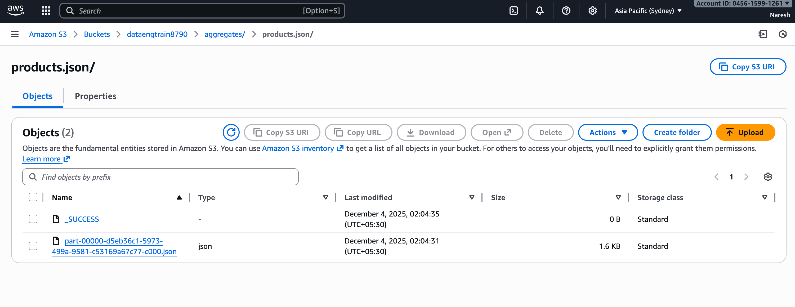

# Pipeline 3: Parquet to JSON

## Overview
This pipeline reads partitioned Parquet files from S3, performs product-level aggregations to calculate total quantity and revenue, and writes the results as JSON to S3.

## Source System
**Storage:** Amazon S3

**Format:** Parquet

**Location:** s3://retail-output/sales/parquet/

**Schema:**
- customer_id: integer
- order_id: integer
- amount: double
- product_name: string
- quantity: integer

## Target System
**Storage:** Amazon S3

**Format:** JSON

**Location:** s3://retail-output/aggregates/products.json

**Schema:**
- product_name: string
- total_quantity: long
- total_revenue: double

## Transformation Logic

### Aggregation Operations
The pipeline performs product-level aggregations:

1. Group by product_name
2. Calculate sum of quantity as total_quantity
3. Calculate sum of amount as total_revenue

### Business Logic
Each product's total quantity represents the cumulative number of units sold across all orders and customers. Total revenue represents the cumulative sales value for each product.

## Data Flow

1. Read partitioned Parquet files from S3
2. Group data by product_name
3. Aggregate quantity and amount using sum functions
4. Write aggregated results as JSON to S3

## Input Data

### Source Parquet Structure

```
s3://retail-output/sales/parquet/
├── customer_id=1/
│   └── part-00000.parquet
├── customer_id=2/
│   └── part-00000.parquet
└── customer_id=3/
    └── part-00000.parquet
```

**Sample Records:**
- customer_id=1, order_id=101, amount=150.50, product_name=Laptop, quantity=1
- customer_id=1, order_id=101, amount=150.50, product_name=Mouse, quantity=2
- customer_id=2, order_id=103, amount=220.00, product_name=Monitor, quantity=2

## S3 Directory Structure

### Complete Structure

```
s3://retail-output/
├── sales/
│   └── parquet/
│       ├── customer_id=1/
│       ├── customer_id=2/
│       └── customer_id=3/
└── aggregates/
    └── products.json/
        ├── part-00000.json
        └── part-00001.json
```


## Avro Schema

The schema defines a record type for aggregated product data:

**Type:** Record  
**Name:** ProductAggregate

**Fields:**
- product_name: string
- total_quantity: long
- total_revenue: double

## Expected Output

### Input Example
Parquet files contain:
- Laptop: 2 orders, quantity=3, amounts=[150.50, 200.00]
- Mouse: 1 order, quantity=2, amount=150.50
- Monitor: 1 order, quantity=2, amount=220.00

### Output Example
JSON file content:

```
{"product_name":"Desk Organizer","total_quantity":2,"total_revenue":125.9}
{"product_name":"Laptop","total_quantity":2,"total_revenue":525.5}
{"product_name":"Mouse","total_quantity":5,"total_revenue":481.25}
{"product_name":"Laptop Stand","total_quantity":1,"total_revenue":175.9}
```


### Aggregation Illustration

**Before Aggregation (Multiple Records):**
- Laptop, quantity=1, amount=150.50
- Laptop, quantity=2, amount=200.00
- Mouse, quantity=2, amount=150.50

**After Aggregation (One Record per Product):**
- Laptop, total_quantity=3, total_revenue=350.50
- Mouse, total_quantity=2, total_revenue=150.50

## Configuration Requirements

### S3 Connection
- S3 endpoint URL
- AWS region
- Access key and secret key
- S3A filesystem implementation
- Credentials provider configuration
- Connection pooling settings

### Spark Settings
- Hadoop S3A configuration for reading and writing
- Executor memory for aggregation operations
- Shuffle partitions for groupBy operations

## Execution Steps

1. Ensure Parquet files exist in s3://retail-output/sales/parquet/
2. Configure AWS credentials for S3 access
3. Package the Spark application
4. Submit the Spark job with required dependencies
5. Verify JSON output in s3://retail-output/aggregates/

## Key Learnings

### Parquet to JSON Conversion
Reading from Parquet and writing to JSON demonstrates:
- Parquet for storage efficiency and fast reads
- JSON for human-readable output and API consumption
- Format flexibility in data pipelines

### Aggregation Functions
The sum aggregation demonstrates:
- GroupBy operations in Spark
- Multiple aggregations in a single operation
- Column aliasing for clear output schema

### Data Reduction
Aggregation significantly reduces data volume:
- Input: Thousands of individual order items
- Output: One record per unique product
- Useful for dashboards and reporting

### JSON Output Format
Spark writes JSON in line-delimited format where:
- Each line is a complete JSON object
- Files can be split across partitions
- Easy to parse and process downstream

### Performance Considerations
- Parquet partitioning improves read performance
- GroupBy operations trigger shuffle operations
- Aggregation reduces output data size significantly
- JSON is less efficient than Parquet for large datasets

### Use Cases
This pipeline pattern is ideal for:
- Creating summary reports
- Building dashboard data sources
- Generating API responses
- Product performance analysis
- Revenue tracking by product