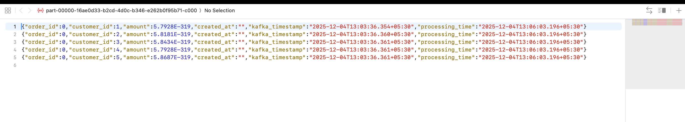

# Pipeline 5: Kafka to S3 JSON Streaming

## Overview
This pipeline consumes Avro-encoded messages from a Kafka topic in real-time, decodes them, adds processing metadata, and writes the data as JSON files to S3.

## Source System
**Message Broker:** Apache Kafka

**Topic:** orders_avro_topic

**Format:** Avro (binary serialized)

**Schema:** OrderRecord with order_id, customer_id, amount, created_at

## Target System
**Storage:** Amazon S3

**Format:** JSON

**Location:** s3://retail-output/stream/json/

**Additional Fields:** kafka_timestamp, processing_time

## Transformation Logic

### Avro Decoding
Binary Avro messages from Kafka are decoded using the OrderRecord schema to extract structured data.

### Metadata Enrichment
Two timestamp fields are added:
- kafka_timestamp: When the message arrived at Kafka
- processing_time: When Spark processed the message

### Batch Processing
Messages are processed in micro-batches every 10 seconds, with each batch written as separate JSON files.

## Data Flow

1. Read streaming data from Kafka topic
2. Decode Avro binary value using schema
3. Extract all fields from decoded data
4. Add kafka_timestamp and processing_time columns
5. Write each micro-batch as JSON files to S3
6. Checkpoint progress for fault tolerance

## Input Source (Kafka)

### Topic Configuration

**Topic Name:** orders_avro_topic

**Message Format:** Avro binary in the value field

**Key:** null (not used)

**Value:** Avro-serialized OrderRecord

### Sample Kafka Message

**Raw Format:** Binary Avro data in value field

**Decoded Structure:**
```json
{
  "order_id": 4,
  "customer_id": 5,
  "amount": 99.99,
  "created_at": "2025-12-04 13:03:36"
}
```

## Output Format (S3 JSON)

### Avro Schema Used for Decoding

**File:** orders.avsc

```json
{
  "type": "record",
  "name": "Order",
  "namespace": "com.retail",
  "fields": [
    { "name": "order_id", "type": "int" },
    { "name": "customer_id", "type": "int" },
    { "name": "amount", "type": "double" },
    { "name": "created_at", "type": "string" }
  ]
}
```

### Output Schema

After decoding and enrichment, each JSON record contains:
- order_id: integer
- customer_id: integer
- amount: double
- created_at: string
- kafka_timestamp: timestamp
- processing_time: timestamp

## S3 Directory Structure

### Output Structure

```
s3://dataengtrain8790/
└── stream/
    └── json/
        ├── part-00000-<uuid>.json
        ├── part-00001-<uuid>.json
        └── part-00002-<uuid>.json
```

### Checkpoint Structure

```
s3://dataengtrain8790/
└── checkpoints/
    └── kafka-to-json/
        ├── commits/
        ├── offsets/
        └── metadata
```

## Expected Output

### Processing Flow Example

**Time: t=0s (Batch 1)**
- 3 messages available in Kafka
- Reads and decodes all 3 messages
- Writes 3 JSON records to S3

**Time: t=10s (Batch 2)**
- No new messages in Kafka
- No output written
- Checkpoint updated

**Time: t=20s (Batch 3)**
- 2 new messages available
- Reads and decodes 2 messages
- Writes 2 JSON records to S3

### Sample JSON Output File

```json
{"order_id":1,"customer_id":101,"amount":250.75,"created_at":"2025-12-03 21:16:27","kafka_timestamp":"2025-12-07T12:52:25.087+05:30","processing_time":"2025-12-07T12:54:04.607+05:30"}
{"order_id":2,"customer_id":102,"amount":120.5,"created_at":"2025-12-03 21:16:27","kafka_timestamp":"2025-12-07T12:52:25.093+05:30","processing_time":"2025-12-07T12:54:04.607+05:30"}
{"order_id":3,"customer_id":103,"amount":575.0,"created_at":"2025-12-04 09:18:38","kafka_timestamp":"2025-12-07T12:52:25.093+05:30","processing_time":"2025-12-07T12:54:04.607+05:30"}
{"order_id":4,"customer_id":101,"amount":75.25,"created_at":"2025-12-03 21:16:27","kafka_timestamp":"2025-12-07T12:52:25.093+05:30","processing_time":"2025-12-07T12:54:04.607+05:30"}
```

### End-to-End Flow

**Pipeline 4 Output (Kafka):**
- Binary Avro message with order_id=5

**Pipeline 5 Processing:**
- Reads binary message from Kafka
- Decodes to structured data
- Adds kafka_timestamp and processing_time
- Writes JSON file to S3

**Pipeline 5 Output (S3):**
- JSON file containing order record with metadata

## Configuration Requirements

### Kafka Connection
- Bootstrap servers address
- Topic name for subscription
- Starting offset strategy (earliest/latest)
- Consumer group configuration

### S3 Connection
- S3 endpoint URL
- AWS region
- Access key and secret key
- S3A filesystem implementation
- Credentials provider configuration

### Spark Streaming Settings
- Checkpoint location for fault tolerance
- Trigger interval (10 seconds)
- Processing time tracking
- Log level configuration

## Execution Steps

1. Ensure Kafka topic orders_avro_topic exists with messages
2. Configure AWS credentials for S3 access
3. Set checkpoint location in S3
4. Package the Spark application with dependencies
5. Submit the streaming job
6. Monitor console output for batch processing logs
7. Verify JSON files in S3 output location

## Key Learnings

### Structured Streaming Consumption
Reading from Kafka with Structured Streaming provides:
- Automatic offset management
- Exactly-once processing semantics
- Fault tolerance through checkpointing
- Scalable parallel consumption

### Avro Deserialization
Using from_avro function enables:
- Schema-based deserialization
- Type safety and validation
- Efficient binary to structured data conversion
- Compatibility with schema evolution

### Checkpoint Management
Checkpointing ensures:
- Recovery from failures without data loss
- Tracking of processed Kafka offsets
- State management across restarts
- Exactly-once guarantees

### Metadata Enrichment
Adding timestamps provides:
- End-to-end latency tracking
- Debugging capabilities
- Audit trail for data lineage
- SLA monitoring

### ForeachBatch Pattern
Using foreachBatch allows:
- Custom logic per micro-batch
- Batch-level error handling
- Detailed logging and monitoring
- Flexible output operations

### JSON for Analytics
Writing to JSON format enables:
- Human-readable output
- Easy integration with analytics tools
- Schema flexibility
- REST API compatibility

### Streaming Pipeline Characteristics
This pipeline demonstrates:
- Near real-time data availability
- Decoupled producer-consumer pattern
- Scalable message processing
- Durable storage for stream data

### Performance Considerations
- Trigger interval balances latency and throughput
- Coalesce reduces number of output files
- Checkpoint frequency affects recovery time
- Kafka consumer parallelism for scalability
- S3 write performance with batch sizing