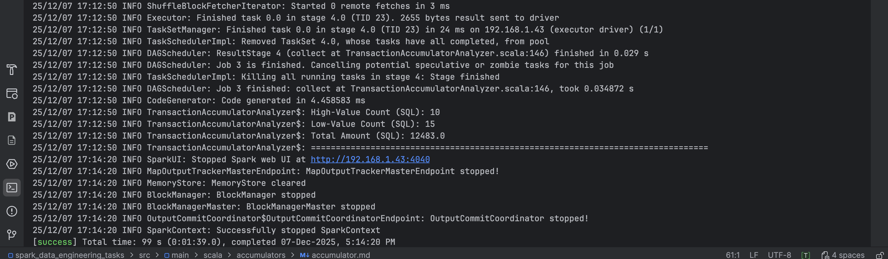
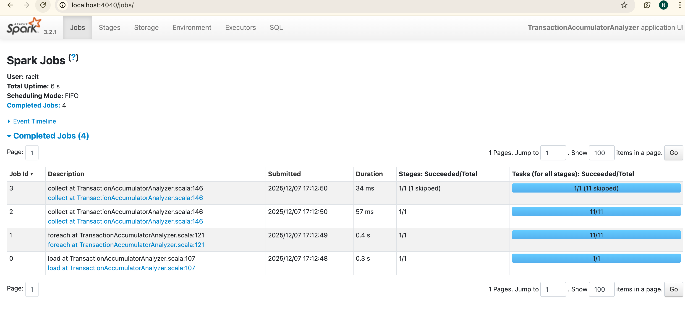
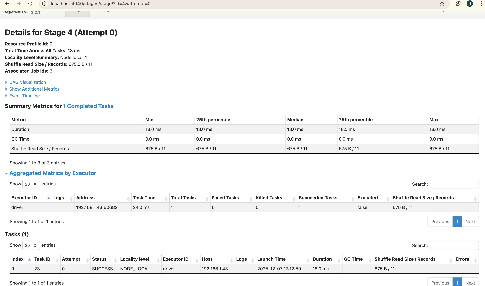

# Transaction Accumulator Analyzer

## Problem

Count transactions exceeding 500 units threshold using Spark accumulators for distributed counting.

---

## Sample Data

```
transactionId | customerId | amount  | category
--------------|------------|---------|------------
1             | 101        | 750.0   | Electronics
2             | 102        | 1200.0  | Electronics
11            | 111        | 45.0    | Groceries
12            | 112        | 120.0   | Clothing
```

**Dataset**: 25 transactions  
**Threshold**: 500 units

---

## Implementation

### Create Accumulator

```scala
val highValueCounter = spark.sparkContext.longAccumulator("High-Value Transactions")
val lowValueCounter = spark.sparkContext.longAccumulator("Low-Value Transactions")
val totalAmountAccumulator = spark.sparkContext.doubleAccumulator("Total Transaction Amount")
```

### Update in Action (Write-Only in Executor)

```scala
transactions.foreach { row =>
  val amount = row.getAs[Double]("amount")

  if (amount > 500.0) {
    highValueCounter.add(1) // Increment counter
  } else {
    lowValueCounter.add(1)
  }

  totalAmountAccumulator.add(amount)
}
```

### Read in Driver (Read-Only)

```scala
println(s"High-Value Transactions: ${highValueCounter.value}")
println(s"Low-Value Transactions: ${lowValueCounter.value}")
println(s"Total Amount: ${totalAmountAccumulator.value}")
```

---

## Results

### Console Output



```
High-Value Count (SQL): 10
Low-Value Count (SQL): 15
Total Amount (SQL): 12483.0
```

**Key Findings:**

- **10 high-value transactions** (> 500 units) - 40% of total
- **15 low-value transactions** (≤ 500 units) - 60% of total
- **Total amount**: 12,483 units across 25 transactions

---

## Spark UI Evidence

### Jobs Tab


**Total Jobs**: 4 completed  
**Total Uptime**: 6 seconds

| Job | Description                  | Duration | Tasks |
|-----|------------------------------|----------|-------|
| 0   | Load data                    | 0.3 s    | 1/1   |
| 1   | foreach (accumulator update) | 0.4 s    | 11/11 |
| 2   | collect                      | 57 ms    | 11/11 |
| 3   | collect (SQL verification)   | 34 ms    | 1/1   |

**Key Job**: Job 1 (foreach) processed all transactions and updated accumulators in **0.4 seconds** across **11 parallel
tasks**.

### Stage Details


**Stage 4 Details:**

- **Total Tasks**: 1 task
- **Duration**: 18.0 ms
- **Shuffle Read**: 675 B / 11 records
- **Status**: SUCCESS
- **Executor**: driver (192.168.1.43)

**Summary Metrics:**

- Min/Median/Max Duration: 18.0 ms
- Shuffle Read: 675 B from 11 records
- All tasks succeeded with no failures

---

## How Accumulators Work

### Parallel Processing

```
Transaction Dataset (25 records)
         ↓
   Split into 11 partitions
         ↓
┌────────┼────────┐
Task 1   Task 2   ... Task 11
  ↓        ↓           ↓
Update   Update      Update
Local    Local       Local
Accum    Accum       Accum
  ↓        ↓           ↓
└────────┴────────────┘
         ↓
   Aggregate in Driver
         ↓
   Final Result:
   High: 10, Low: 15
```

### Write-Only in Executors

```scala
// Inside executor (foreach action)
highValueCounter.add(1) // ✅ Write allowed
// highValueCounter.value  // ❌ Read NOT allowed
```

### Read-Only in Driver

```scala
// In driver after action completes
val count = highValueCounter.value // ✅ Read allowed
println(s"Count: $count")
```

---

## Requirements Fulfilled

**Create accumulator**: `longAccumulator("High-Value Transactions")`  
**Process in parallel**: 11 tasks processed partitions in 0.4 seconds  
**Update accumulator**: `add(1)` called inside foreach action  
**Print total count**: Console shows 10 high-value, 15 low-value transactions

---

## Verification

### Accumulator Results

- High-Value: 10 transactions
- Low-Value: 15 transactions
- Total Amount: 12,483 units

### SQL Verification

- High-Value (SQL): 10
- Low-Value (SQL): 15
- Total Amount (SQL): 12,483

**Results Match**: Accumulator counts verified with SQL aggregation

---

## Summary

### What Was Achieved

1. Created 3 accumulators (high-value counter, low-value counter, total amount)
2. Processed 25 transactions across 11 parallel tasks in 0.4 seconds
3. Updated accumulators inside foreach action (write-only in executors)
4. Read final values in driver after processing completed
5. Verified results with SQL aggregation - perfect match

### Key Findings

- **40% of transactions** exceed 500 threshold (10 out of 25)
- **Parallel execution**: 11 tasks processed data simultaneously
- **Total value**: 12,483 units processed
- **Verification**: 100% match between accumulators and SQL

```

---

## Screenshots to Add

Create `screenshots/` folder with:

1. **jobs_tab.png** - Your Image 1 showing 4 completed jobs
2. **stage_details.png** - Your Image 2 showing Stage 4 details with 18ms duration
3. **console_output.png** - Screenshot of your console showing:
```

High-Value Count (SQL): 10
Low-Value Count (SQL): 15
Total Amount (SQL): 12483.0