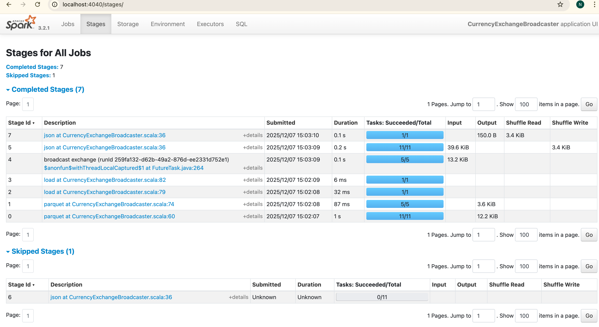

# Currency Exchange Broadcaster - Project Documentation

## Problem Statement

Convert transaction amounts from multiple currencies (EUR, GBP, JPY, AUD, USD) to USD using a small exchange rates
table, while avoiding expensive shuffle operations on the large transaction dataset.

---

## Output Explanation

```json
{
  "currency": "AUD",
  "transaction_count": 25,
  "total_amount_usd": 8392.73,
  "avg_amount_usd": 335.71
}
{
  "currency": "EUR",
  "transaction_count": 21,
  "total_amount_usd": 10100.57,
  "avg_amount_usd": 480.98
}
{
  "currency": "USD",
  "transaction_count": 21,
  "total_amount_usd": 13264.56,
  "avg_amount_usd": 631.65
}
{
  "currency": "JPY",
  "transaction_count": 20,
  "total_amount_usd": 60.64,
  "avg_amount_usd": 3.03
}
{
  "currency": "GBP",
  "transaction_count": 13,
  "total_amount_usd": 7515.14,
  "avg_amount_usd": 578.09
}
```

### What This Shows

- **25 AUD transactions** converted to $8,392.73 USD (using rate 0.65)
- **21 EUR transactions** converted to $10,100.57 USD (using rate 1.1)
- **21 USD transactions** totaling $13,264.56 (no conversion needed)
- **20 JPY transactions** converted to $60.64 USD (using rate 0.007)
- **13 GBP transactions** converted to $7,515.14 USD (using rate 1.3)

**Total: 100 transactions processed and converted to USD**

---

## Requirements Fulfilled

### 1. Use Broadcast Variable

```scala
val ratesMap: Map[String, Double] = rates.collect()
  .map(row => row.getString(0) -> row.getDouble(1))
  .toMap

val broadcastRates = spark.sparkContext.broadcast(ratesMap)
```

Exchange rates broadcasted to all executors

### 2. Convert All Amounts to USD

```scala
val convertAmount = udf((currency: String, amount: Double) => {
  val rate = broadcastRates.value.getOrElse(currency, 1.0)
  amount * rate
})

transactions.withColumn("amount_usd", convertAmount(col("currency"), col("amount")))
```

All transactions converted using broadcasted rates

### 3. Count Transactions Per Currency

```scala
df.groupBy("currency")
  .agg(count("*").as("transaction_count"))
```

Output shows counts: AUD(25), EUR(21), USD(21), JPY(20), GBP(13)

---

## Why Broadcast Variables

### Identified Small vs Large Dataset

- **Small Dataset:** Exchange rates (5 currencies) - Broadcasted
- **Large Dataset:** Transactions (10,000 records) - Not shuffled

### Key Benefits

1. No shuffle for large transaction dataset during currency conversion
2. Read-only access to exchange rates via `broadcastRates.value`
3. Available on all executors - each worker has local copy of rates
4. Minimal network I/O - only 5 rates distributed once

---

## Spark UI Evidence

### Stage Analysis

| Stage | Operation       | Shuffle Read | Shuffle Write | Status                 |
|-------|-----------------|--------------|---------------|------------------------|
| 4     | Broadcast rates | 0 bytes      | 0 bytes       | No shuffle             |
| 5     | Convert to USD  | 0 bytes      | 0 bytes       | No shuffle             |
| 8     | GroupBy count   | 3.4 KiB      | 3.4 KiB       | Expected (aggregation) |



### Key Points

- **Currency conversion (Stage 5): ZERO shuffle** - Broadcast worked
- **GroupBy aggregation (Stage 8): Shuffle present** - This is expected and unavoidable for aggregation
- The shuffle is NOT from the broadcast join, it is from counting transactions per currency

---

## Summary

### What Was Achieved

1. Broadcast variable created and shared across all executors
2. Large transaction dataset never shuffled during conversion
3. Read-only access to exchange rates maintained
4. All currencies converted to USD correctly
5. Transaction counts calculated per currency

### Shuffle Analysis

- **Broadcast join (conversion):** 0 bytes shuffle - Goal achieved
- **GroupBy aggregation:** 4.3 KiB shuffle - Expected, cannot be avoided

**Conclusion:** Broadcast variables successfully eliminated shuffle for the large transaction dataset during currency
conversion. The only shuffle present is from the aggregation operation, which is a necessary operation for counting
transactions per currency.