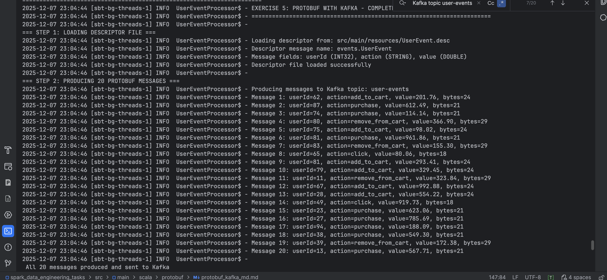
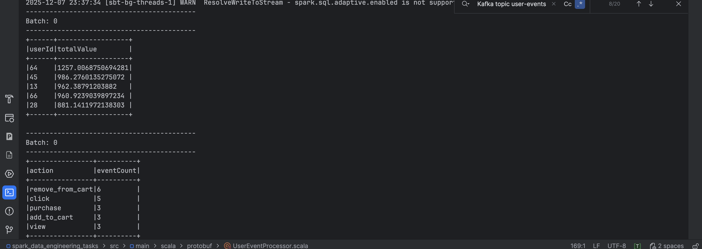

# Exercise 5: Protobuf with Kafka

## Problem Statement

Process Protobuf-encoded messages from Kafka topic user-events in Spark. Deserialize messages, count events per action
type, and identify top 5 users with highest values.

## Setup

### Proto File

Create `src/main/proto/UserEvent.proto`:

```proto
syntax = "proto3";
package events;

message UserEvent {
  int32 userId = 1;
  string action = 2;
  double value = 3;
}
```

### Generate Descriptor File

```bash
protoc --descriptor_set_out=src/main/resources/UserEvent.desc src/main/proto/UserEvent.proto
```

### Create Kafka Topic

```bash
bin/kafka-topics.sh --create --topic user-events --bootstrap-server localhost:9092 --partitions 3 --replication-factor 1
```

### Start Services

```bash
# Terminal 1: Zookeeper
bin/zookeeper-server-start.sh config/zookeeper.properties

# Terminal 2: Kafka
bin/kafka-server-start.sh config/server.properties
```

## Solution Steps

### Step 1: Load Descriptor File

Loads `UserEvent.desc` containing Protobuf schema with fields: userId (INT32), action (STRING), value (DOUBLE).

### Step 2: Produce Messages

Generates 20 random Protobuf messages with:

- userId: Random 1-100
- action: click, view, purchase, add_to_cart, remove_from_cart
- value: Random 0-1000

Serializes to binary format and sends to Kafka topic.

### Step 3: Consume and Process

Spark reads messages from Kafka as byte arrays. Deserializes using descriptor UDF. Performs two analyses:

1. Count events per action type
2. Sum values per userId, select top 5

## Data Flow

```
Descriptor Schema → Producer → Protobuf Binary → Kafka Topic → Spark Consumer → Deserialize → Analysis → Console Output
```

## Expected Output

### Producer Output

```
=== STEP 2: PRODUCING 20 PROTOBUF MESSAGES ===
Message 1: userId=55, action=click, value=134.53, bytes=18
Message 2: userId=2, action=remove_from_cart, value=450.93, bytes=29
Message 3: userId=78, action=click, value=775.62, bytes=18
...
Message 20: userId=69, action=remove_from_cart, value=31.76, bytes=29

✓ All 20 messages produced and sent to Kafka
```



### Analysis Output

```
=== STEP 3: CONSUMING AND PROCESSING MESSAGES ===

Event Count by Action:
+----------------+----------+
|action          |eventCount|
+----------------+----------+
|remove_from_cart|6         |
|click           |5         |
|add_to_cart     |4         |
|purchase        |3         |
|view            |2         |
+----------------+----------+

Top 5 Users by Value:
+------+------------------+
|userId|totalValue        |
+------+------------------+
|38    |917.08            |
|86    |885.29            |
|33    |869.31            |
|28    |846.10            |
|25    |788.14            |
+------+------------------+

✓ Processing completed
```



## Key Concepts

**Protobuf**: Binary serialization format. Converts structured data to compact bytes.

**Descriptor File**: Schema definition used at runtime without generated classes.

**Kafka**: Message broker storing 20 binary Protobuf messages in topic.

**Spark Streaming**: Reads Kafka messages, deserializes with UDF, performs analytics.

**DynamicMessage**: Parses Protobuf bytes using descriptor without generated code.

## Error Handling

Invalid/malformed messages caught with Try-Catch, default to userId=0, action=unknown. Filters remove unknown records.

## Configuration

- Kafka: localhost:9092
- Topic: user-events
- Starting offset: earliest
- Spark: local[*]

## Summary

Complete workflow: Producer serializes 20 messages to Protobuf format → Kafka stores binary messages → Spark
deserializes and analyzes → Output shows event distribution and top users by value.